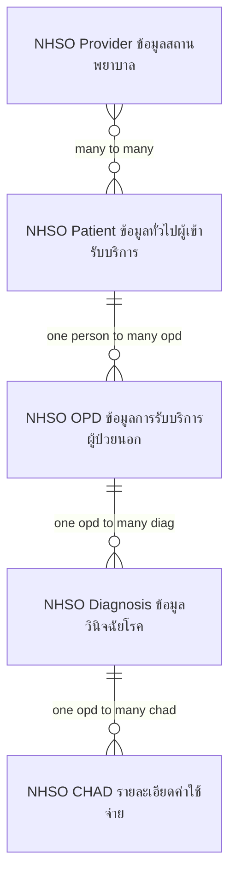
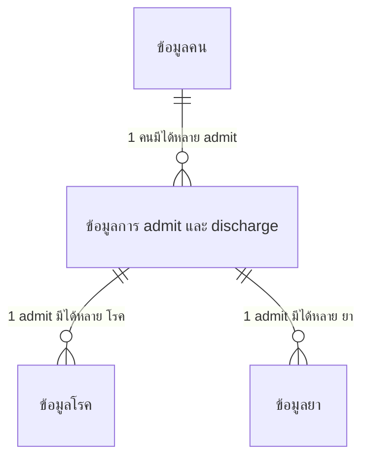
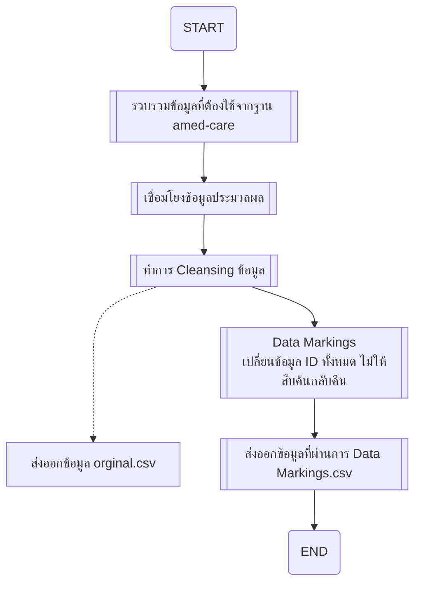
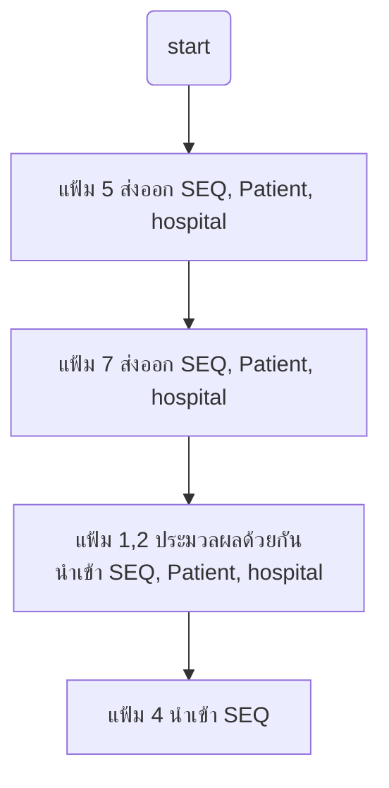
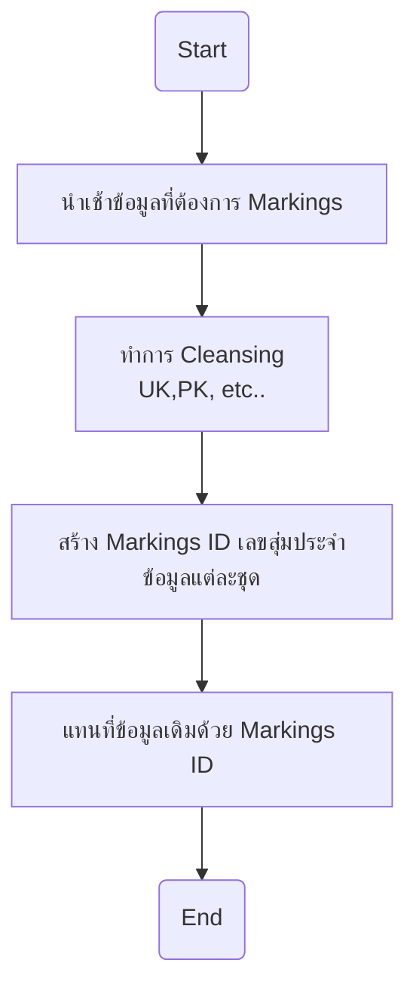

# แมพโครงสร้างกับ 13 แฟ้ม

- [แมพโครงสร้างกับ 13 แฟ้ม](#แมพโครงสร้างกับ-13-แฟ้ม)
  - [แฟ้มที่ใช้](#แฟ้มที่ใช้)
    - [อธิบาย](#อธิบาย)
    - [แฟ้มที่ 1 NHSO Patient](#แฟ้มที่-1-nhso-patient)
    - [แฟ้มที่ 2 NHSO Provider](#แฟ้มที่-2-nhso-provider)
    - [แฟ้มที่ 4 NHSO OPD](#แฟ้มที่-4-nhso-opd)
    - [แฟ้มที่ 5 NHSO Diagnosis](#แฟ้มที่-5-nhso-diagnosis)
    - [แฟ้มที่ 7 NHSO CHAD](#แฟ้มที่-7-nhso-chad)
- [ออกแบบลำดับการประมวลผล](#ออกแบบลำดับการประมวลผล)
  - [er diagram โครงสร้าง 13 แฟ้ม](#er-diagram-โครงสร้าง-13-แฟ้ม)
  - [er diagram ฐาน amed](#er-diagram-ฐาน-amed)
  - [ภาพรวม](#ภาพรวม)
    - [โฟล เชื่อมโยงข้อมูลประมวลผล](#โฟล-เชื่อมโยงข้อมูลประมวลผล)
    - [โฟล Data Markings ใหม่ที่ใช้](#โฟล-data-markings-ใหม่ที่ใช้)
  - [กระบวนการ Cleansing](#กระบวนการ-cleansing)
- [Note อื่นๆ](#note-อื่นๆ)
  - [DIAGTYPE](#diagtype)

## แฟ้มที่ใช้
- แฟ้มที่ 1 NHSO Patient ข้อมูลทั่วไปของผู้เข้ารับบริการ
- แฟ้มที่ 2 NHSO Provider ข้อมูลสถานพยาบาลที่ให้บริการผู้เข้ารับบริการ
- แฟ้มที่ 4 NHSO OPD ข้อมูลการมารับบริการผู้ป่วยนอก (OPD) ของผู้เข้ารับบริการ
- แฟ้มที่ 5 NHSO Diagnosis ข้อมูลวินิจฉัยโรคของผู้เข้ารับบริการ
- แฟ้มที่ 7 NHSO CHAD ข้อมูลรายละเอียดค่าใช้จ่ายรายรายการของผู้เข้ารับบริการตามรหัสมาตรฐาน

### อธิบาย
1. ไฟล์รูปแบบ `excel` และ `csv` เป็นโครงสร้างตามโครงสร้าง 13 แฟ้ม สปสช. โดย `csv` จะใช้ตัวคั้นเป็น `,`
2. จะมีการเพิ่ม field พิเศษตามความต้องการของ user โดยจะขึ้นต้นด้วย `CUSTOM_` ซึ่งเป็น field นอกมาตฐาน 13 แฟ้ม ไม่แนะนำให้ใช้สำหรับการประมวลผล
3. `field` ที่ไม่มีการส่งออกข้อมูล คือ ที่มีคำอธิบายลงท้ายว่าว่า **ไม่ส่งออก**
4. คำอธิบายที่ลงท้ายด้วย **marking** คือ มีข้อมูล แต่ส่งออกขั้นสุดท้ายโดนปิดไว้ไม่ส่งออก เพราะเนื่องจาก อาจมีข้อมูลบุคคล
5. ไฟล์ที่ส่งออกจะทำการ **marking** ข้อมูลไม่ให้ตามหาข้อมูลเดิมได้ แต่ความหมายยังเหมือนเดิม เช่น ถ้าค่า `CID` เดียวกันหมายถึงคนเดียวกัน หรือ `PROFESSION_ID` คนเดียวกันหมายถึง Diagnosis จากเจ้าหน้าที่คนเดียวกัน โดนมี `field` ที่ทำการ **marking** ดังนี้
   - `SEQ` ทุกไฟล์
   - `PERMITNO` อยู่ในไฟล์ 4 OPD
   - `INVOICE_NO` อยู่ในไฟล์ 7 CHAD
   - `HCODE`, `HCODE_NAME` อยู่ในไฟล์ 2 Provider
   - `PROFESSION_ID` อยู่ในไฟล์ 5 Diagnosis
   - `CID` อยู่ในไฟล์ 1 Patient
6. `ID` ที่ใช้ทำหรับการ **marking** การส่งออกแต่ละครั้งจะไม่เหมือนกัน โดนจะทำการสุ่มเลข แล้ว เรียงลำดับเลขที่สุ่มใหม่ทุกครั้งที่ส่งออก ถ้าต้องการ Lookup ข้อมูลตัว `ID` ที่ทำการ **marking** ให้ติดต่อผู้พัฒนา เพราะข้อมูลที่สามารถตามหาข้อมูลเดิมได้ ไม่ได้ส่งออกมา เพื่อป้องกันข้อมูลหลุด
   - หากมีการส่งออกข้อมูลครั้งใหม่ จำเป็นต้องนำเข้าใหม่ทั้งหมด

### แฟ้มที่ 1 NHSO Patient
- SEQ admits._id
- TYPE fix CID = ประเภทบัตรประชาชน
- CID permissions_user.username เลขบัตรประชาชน **marking**
- PPN null **ไม่ส่งออก**
- PWD null **ไม่ส่งออก**
- NAME.GIVEN permissions_user.name **ไม่ส่งออก**
- NAME.FAMILY permissions_user.surname **ไม่ส่งออก**
- BIRTHDATE permissions_user.birth วันเกิด รูปแบบตาม 13 แฟ้ม `yyyy-MM-dd` `2021-12-31`
- GENDER permissions_user.gender เพศ แปลงเป็นเลข 1=ชาย, 2=หญิง
- ADDRESS.LINE null **ไม่ส่งออก**
- ADDRESS.CITY null **ไม่ส่งออก**
- ADDRESS.DISTRICT null **ไม่ส่งออก**
- ADDRESS.STATE null **ไม่ส่งออก**
- ADDRESS.POSTALCODE null **ไม่ส่งออก**
- NATIONALITY permissions_user.nationality **ไม่ส่งออก**
- RACE permissions_user.nationality **ไม่ส่งออก**
- HN admits.patientDetail.hn **ไม่ส่งออก**
- AN admits.patientDetail.an **ไม่ส่งออก**
- **CUSTOM_AGE อายุ**

### แฟ้มที่ 2 NHSO Provider
- SEQ admits._id
- HCODE hospitals.prefix รหัสสถานพยาบาล 5 หลัก
- HCODE_NAME hospitals.name ชื่อสถานพยาบาล
- HCODE_SEND hospitals.prefix **ไม่ส่งออก**
- HCODE_SEND_NAME hospitals.name **ไม่ส่งออก**
- HMAIN null **ไม่ส่งออก**
- HMAIN_NAME  null **ไม่ส่งออก**
- AN admits.patientDetail.an **ไม่ส่งออก**
- **CUSTOM_HCODE_TYPE** ประเภทสถานพยาบาลในระบบ amed

### แฟ้มที่ 4 NHSO OPD
ติดไว้ก่อนยังไม่ต้องทำพบ PERMITNO หลายตัวยัง งงๆ อยู่
- SEQ admits._id
- DATEOPD admits.createdAt วันที่เข้ารับบริการ รูปแบบตาม 13 แฟ้ม `yyyy-MM-dd'T'HH:mm:ss` `2021-12-31T13:15:30`
- INSCL null
- PERMITNO รหัส Claim Code **ยังไม่แน่ใจ** **marking**
  - lookup users-permissions_user.opself ไปหา components_user_opselves.history*.claimCode
    ```
    ใน components_user_opselves.history* จะมี hcode อยู่ต้องเอามาแมพกลับว่าเป็นของ user ไหน
    ตัวอย่าง id 6678f84cfc37f586a49b72f1
    ```
  - lookup users-permissions_user.sclaim*.ref ไปหา components_user_sclaims.authenCode
  - admit.patientDetail.opself.ccode
  - เหมือน 2 อันบนจะมีเลขที่ไม่ซ้ำกัน
  - PERMITNO 2 วันยังงมอยู่ เอาเท่าที่ได้ เหมือนข้อมูล api ตัวใหม่จะเป็นโครงสร้าง database อีกแบบเดี๊ยวค่อยตาม **TODO**
- HTYPE null **ไม่ส่งออก**
- UUC null **ไม่ส่งออก**
- CHIEFCOMP null **ไม่ส่งออก**
- BTEMP null **ไม่ส่งออก**
- SBP null **ไม่ส่งออก**
- DBP null **ไม่ส่งออก**
- PR null **ไม่ส่งออก**
- RR null **ไม่ส่งออก**
- WAISTLINE null **ไม่ส่งออก**
- WEIGHT null **ไม่ส่งออก**
- HEIGHT null **ไม่ส่งออก**
- HEADCIRCUM null **ไม่ส่งออก**
- CLINIC null **ไม่ส่งออก**

### แฟ้มที่ 5 NHSO Diagnosis
- SEQ admits._id
- DATEDX diagnoses.createdAt วันเดือนปีที่วินิจฉัยโรค รูปแบบตาม 13 แฟ้ม `yyyy-MM-dd'T'HH:mm:ss` `2021-12-31T13:15:30`
- DIAG diagnoses.diseases วินิจฉัยโรคตามรหัส ICD 10 ต้องเอาไป lookup หา icd10 
- DIAGTYPE null **ไม่ส่งออก**
- PROFESSION_ID diagnoses.doctor เลขใบอนุญาตประกอบวิชาชีพ  **ให้ใช้เป็น data masking**
- CLINIC null **ไม่ส่งออก**
- AN admits.patientDetail.an **ไม่ส่งออก**

### แฟ้มที่ 7 NHSO CHAD 
- SEQ admits._id
- STDCODE null **ไม่ส่งออก**
- INVOICE_NO drug._id **ไม่ส่งออก**
- SERVDATE drugs.createdAt วันที่ ให้/ใช้ บริการรูปแบบตาม 13 แฟ้ม `yyyy-MM-dd'T'HH:mm:ss` `2021-12-31T13:15:30`
- LOCALCODE fix tpu รหัสรายการค่าบริการที่สถานพยาบาลกำหนด
- DESCRIPT ชื่อรายการที่สถานพยาบาลกำหนด รวมหน่วยนับ/เรียก ถ้ามี
  - ETL Note: ต้องเอา drug ไป lookup "ชื่อยาname unit"
- QTY จำนวนหน่วยที่ใช้
  - ETL Note: components_drug_medicines.qty ต้องเอา drug.medicines มา lookup
- UNITPRICE null **ไม่ส่งออก**
- CHARGEAMT null **ไม่ส่งออก**
- CODESYS fix "TMT" ระบบรหัสที่ใช้กับ STDCODE
- LAB_RESULT null **ไม่ส่งออก**
- UNIT หน่วยนับ 
  - ETL Note: medicines.unit
- REIMBPRICE null **ไม่ส่งออก**
- XRAY_RESUT null **ไม่ส่งออก**
- PATHO_RESULT null **ไม่ส่งออก**
- AN admits.patientDetail.an **ไม่ส่งออก**
- PROJCODE null **ไม่ส่งออก**
- SP_ITEM null **ไม่ส่งออก**
- DRUGREMARK null **ไม่ส่งออก**
- PA_NO null **ไม่ส่งออก**
- USE_STATUS null **ไม่ส่งออก**
- CAGCODE null **ไม่ส่งออก**
- SERIALNO null **ไม่ส่งออก**
- SIGCODE null รหัสวิธีใช้ยา **ไม่ส่งออก**
- SIGTEXT null วิธีใช้ยา **ไม่ส่งออก**
- **CUSTOM_TPUID**
- **CUSTOM_TPUFSN**
- **CUSTOM_GPUID**
- **CUSTOM_GPUFSN**
- **CUSTOM_CONTENT** อาจจะไม่ต้องใส่ เพราะเป็น free text ผู้ใช้กรอกอะไรมาก็ได้ อาจมีข้อมูลส่วนบุคคล และพบเจอมีการใส่ชื่อจริงลงไปจำนวนมาก **marking**

# ออกแบบลำดับการประมวลผล
## er diagram โครงสร้าง 13 แฟ้ม


## er diagram ฐาน amed


## ภาพรวม
ออกแบบกระบวนการประมวลผล มีการเพิ่ม **Data Markings** เข้าไปเพื่อไม่ให้สืบค้นกลับหาต้นของข้อมูลได้


### โฟล เชื่อมโยงข้อมูลประมวลผล


### โฟล Data Markings ใหม่ที่ใช้


## กระบวนการ Cleansing
เนื่องจากแฟ้มที่ 1 กับ 2  เกิดจากข้อมูลจากทุกแฟ้ม จะใช้ตัวนี้เป็นตัวตั้งต้น โดยทุกแฟ้มต้องมี SEQ ในแฟ้ม 1 และ 2  
เช่น มีข้อมูล แต่อาจจะไม่มีข้อมูลในแฟ้ม 1 และ 2 ก็นำข้อมูลส่วนนั้นออก


# Note อื่นๆ
## DIAGTYPE
วันเวลาที่ Diag อาจเกิดทีหลังการจ่ายยาได้ เพราะว่า ระบบไม่ได้บังคัง สามารถมาใส่เพิ่มตอนหลังได้
```
DIAGTYPE
1 = PRINCIPLE DX (การวินิจฉัยโรคหลัก) 
2 = CO-MORBIDITY(การวินิจฉัยโรคร่วม) 
3 = COMPLICATION(การวินิจฉัยโรคแทรก)
4 = OTHER (อื่น ๆ) 
5 = EXTERNAL CAUSE(สาเหตุภายนอก) 
6 = Additional Code (รหัสเสริม) 
7 = Morphology Code (รหัสเกี่ยวกับเนื้องอก)
```