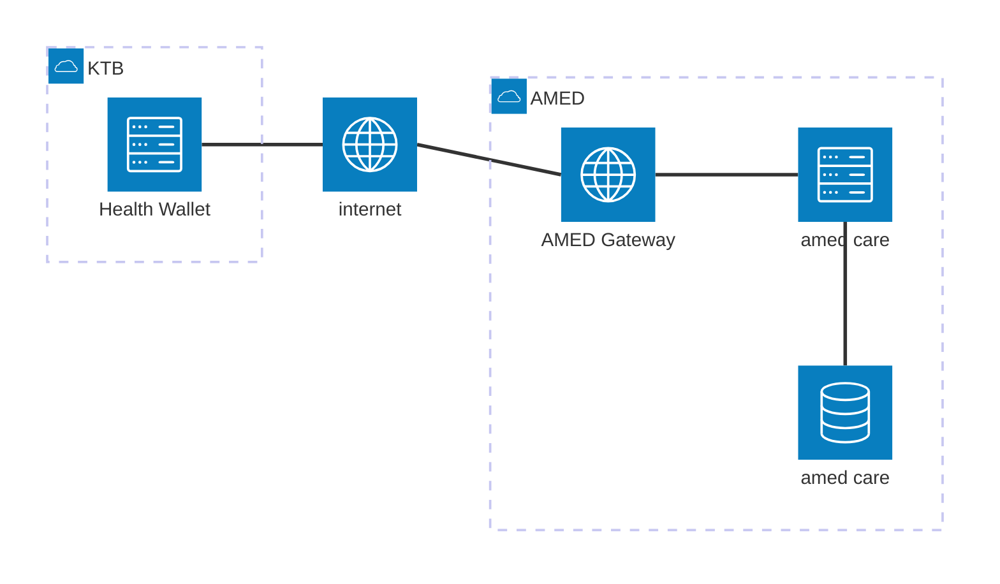

# เกริ่น
เป็นส่วนของไดอะแกรมการเรียกใช้งาน api ระหว่าง KTB กับ amed โดยในตอนนี้จะมีโฟลการไหลของของข้อมูลทั้งหมด 3 ข้อคือ
1. Get Hospital List เรียกดูรายชื่อหน่วยทีเข้าร่วมโครงการต่างๆ
2. Create Appointment สร้างการนัดหมาย หรือ ส่งข้อมูลรายละเอียดเข้าสู่ amed
3. Update Appointment Status ตอบกลับสถานะ ยืนยันการเข้ารับ/ยกเลิก จากข้อที่ 2 ไปยังระบบที่สร้างการนัดหมาย

## Diagram
