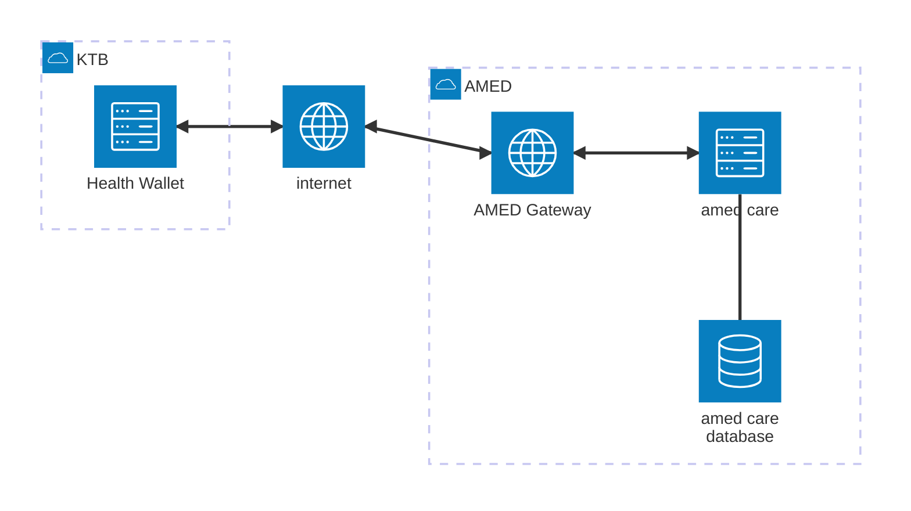
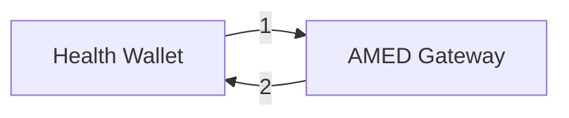

- [เกริ่น](#เกริ่น)
  - [Diagram ภาพรวม](#diagram-ภาพรวม)
  - [ออกแบบกระบวนการทำงานการไหลของข้อมูล](#ออกแบบกระบวนการทำงานการไหลของข้อมูล)
    - [1. Get Hospital List](#1-get-hospital-list)
    - [2. Create Appointment](#2-create-appointment)
    - [3. Update Appointment Status](#3-update-appointment-status)

# เกริ่น
เป็นส่วนของไดอะแกรมการเรียกใช้งาน api ระหว่าง KTB กับ amed โดยในตอนนี้จะมีโฟลการไหลของของข้อมูลทั้งหมด 3 ข้อคือ
1. Get Hospital List เรียกดูรายชื่อหน่วยทีเข้าร่วมโครงการต่างๆ
2. Create Appointment สร้างการนัดหมาย หรือ ส่งข้อมูลรายละเอียดเข้าสู่ amed
3. Update Appointment Status ตอบกลับสถานะ ยืนยันการเข้ารับ/ยกเลิก จากข้อที่ 2 ไปยังระบบที่สร้างการนัดหมาย

## Diagram ภาพรวม

- `Health Wallet` ระบบกระเป๋าสุขภาพ
- `AMED Gateway` รับหน้าที่เป็นตัวกลางสื่อสารระหว่าง `amed care` กับ `Health Wallet` เผื่อในกรณีรูบแบบข้อมูลการสื่อสารฝั่งใดฝั่งหนึ่งเปลี่ยน หรือ บางชุดข้อมูลที่เป็นลักษณะ **static(ค่าคงที่)** จะสร้างขึ้นจากที่นี่
- `amed care` ระบบ AMED Care
- `amed care database` ฐานข้อมูลของระบบ `amed care`

## ออกแบบกระบวนการทำงานการไหลของข้อมูล
### 1. Get Hospital List
เรียกดูรายชื่อหน่วยบริการที่เข้าร่วมโครงการต่างๆ เพื่อนำเสนอหน่วยบริการให้แก่ผู้รับบริการ
- เป็นข้อมูลในลักษณะ static(ค่าคงที่) จะทำการสร้างข้อมูลที่ส่วน `AMED Gateway`
- การ update ชุดข้อมูล จะทำโดยนำเข้าข้อมูลจาก google sheet ที่เป็นลักษณะแบบสอบถาม

<details>
<summary>คลิกเพื่อเปิดดูคำอธิบายโฟล</summary>
<ol type="1">
    <li>Health Wallet ส่งคำขอข้อมูล Get Hospital List เข้ามายัง AMED Gateway</li>
    <li>AMED Gateway ทำการคืนข้อมูลรายชื่อหน่วยบริการที่เข้าร่วมโครงการ</li>
</ol> 
</details>

### 2. Create Appointment
สร้างนัดหมาย กรณีได้มีการ walk-in ไปที่หน่วยบริการ แล้วในวันนั้น จะ `ไม่อนุญาต` ให้มีการ `นัดหมายเพิ่มในวันนั้น` ไม่ว่าจะเป็นนัดหมายที่เดิมหรือที่ใหม่ ให้ระบบทำการตรวจสอบและตอบ `Error 2000 - Status doesn't match` กลับมาเพื่อป้องกันไม่ให้ผู้ป่วยนัดหมายและเข้ารับบริการซ้ำ

- เป็นขข้อมูลลักษณะ เปลี่ยนแปลงตามขข้อมูลทีเกิดขึ้นจริง ณ ขณะนั้นโดยจะมี 2 แนวทางคือ
  1. ระบบ `amed care` มี api สำหรับเช็คว่า **ผู้ป่วย** ได้เกิด `admit` ในวันนั้นแล้วหรือไม่ โดย input จะเป็น [`ผู้ป่วย`, `วันที่`]
        ```mermaid
        flowchart LR
            hw["Health Wallet"]
            gw["AMED Gateway"]
            amed["amed care"]

            hw -->|"1"| gw
            gw -->|"2"| amed
            amed -->|"3"| gw
            gw -->|"4"| hw
        ```
        <details>
        <summary>คลิกเพื่อเปิดดูคำอธิบายโฟล</summary>
        <ol type="1">
            <li>Health Wallet ส่งข้อมูลสร้างนัดหมายเข้าระบบ AMED Gateway</li>
            <li>AMED Gateway ทำการเช็คกับระบบ amed care เพื่อดูว่าวันนี้ได้เกิดการ admit ของคนนี้แล้วหรือยัง</li>
            <li>amed care ตอบกลับผล</li>
            <li>AMED Gateway ตอบกลับไปยัง Health Wallet ตามรูปแบบที่ตกลงกันไว้</li>
        </ol> 
        </details>
    
  2. `AMED Gateway` เชื่อมกับ `amed care database` โดยตรงและสืบค้นและเพิ่มข้อมูลตรงเข้าฐานข้อมูล
    - จะมีข้อเสียหลักคือ เขียนข้อมูลเข้าสู่ฐานข้อมูลโดยตรงไม่ผ่าน api ตัว `credential` ที่ใช้เข้าถึงฐานข้อมูลหากไม่มีการดูแลจัดการ อาจสามารถเขียนทับข้อมูลส่วนอื่นได้ด้วย
        ```mermaid
        flowchart LR
            hw["Health Wallet"]
            amed["amed care database"]

            hw -->|"1"| gw
            gw <-->|"2"| amed
            gw -->|"3"| amed
            gw -->|"4"| hw
        ```
        <details>
        <summary>คลิกเพื่อเปิดดูคำอธิบายโฟล</summary>
        <ol type="1">
            <li>Health Wallet ส่งข้อมูลสร้างนัดหมายเข้าระบบ AMED Gateway</li>
            <li>AMED Gateway เข้าไปสืบค้นข้อมูลที่ amed care database เพื่อดูว่าวันนี้ได้เกิดการ admit ของคนนี้แล้วหรือยัง</li>
            <li>หากพบว่ายังเกิดการ admit ในวันนี้จะทำการ เพิ่ม/เขียนข้อมูลทับ ด้วย KEY [เลขบัตร,วันที่จองนัดหมาย] และตามด้วยข้อมูลอื่นๆ เช่น [สีอาการ, คำแนะนำ]</li>
            <li>AMED Gateway ตอบกลับไปยัง Health Wallet ตามรูปแบบที่ตกลงกันไว้</li>
        </ol> 
        </details>

### 3. Update Appointment Status
เมื่อผู้ป่วยเข้ารับบริการตามนัดหมาย ให้ส่งข้อมูลการเข้ารับบริการสำเร็จที่กลับมาที่กระเป๋าสุขภาพ `Health Wallet `
- เป็นขข้อมูลลักษณะ เปลี่ยนแปลงตามเหตุการณ์ เมื่อเกิดการ `ปิดสิทธิ` โดยจะมี 2 แนวทางคือ
  1. เมื่อเกิดการ `ปิดสิทธิ` ระบบ `amed care` เรียก api มายัง `AMED Gateway` แล้ว `AMED Gateway` จะส่งข้อมูลต่อไปยัง `Health Wallet`
        ```mermaid
        flowchart LR
            U(("เมื่อปิดสิทธิ"))
            amed["amed care"]
            gw["AMED Gateway"]
            hw["Health Wallet"]

            U -->|1| amed -->|2| gw -->|3| hw
        ```
        <details>
        <summary>คลิกเพื่อเปิดดูคำอธิบายโฟล</summary>
        <ol type="1">
            <li>เมื่อเกิดเหตุการณ์ปิดสิทธิให้เริ่มกระบวนการ Update Appointment Status ที่ amed care</li>
            <li>ส่งข้อมูลการปิดสิทธิไปยัง AMED Gateway โดยจำเป็นต้องมีข้อมูล [วันที่ admit, รหัสบัตร, วันที่ปิดสิทธิ์]</li>
            <li>AMED Gateway ทำการค้นประวัติการจองเพื่อหา RefId  หากพบจะส่งข้อมูลกลับไปยัง Health Wallet</li>
        </ol> 
        </details>

  2. `AMED Gateway` เชื่อมกับ `amed care database` โดยตรงและสืบค้นตรงจากฐานข้อมูล โดยจะทำงานเป็นลักษณะ batch แบบกำหนดเวลา โดยจะมีข้อเสียหลัก คือ การประมวลผลนาน เพราะต้องประมวลข้อมูลทั้งหมดในระบบ และ `credential` ที่ใช้เข้าถึงฐานข้อมูลสามารถเข้าถึงข้อมูลได้ทั้งหมด
        ```mermaid
        flowchart LR
            gw["AMED Gateway"]
            hw["Health Wallet"]
            amed[(amed care database)]

            gw <-->|1| amed 
            gw -->|2| hw
        ```
        <details>
        <summary>คลิกเพื่อเปิดดูคำอธิบายโฟล</summary>
        <ol type="1">
            <li>เมื่อถึงเวลาที่กำหนด AMED Gateway จะเริ่มกระบวนการตรวจสอบ Update Appointment Status จากข้อมูล ในฐานข้อมูลทั้งหมด</li>
            <li>AMED Gateway ทำการจับคู่ข้อมูล และ ค้นหา RefId </li>
            <li>ส่งข้อมูลกลับไปยัง Health Wallet</li>
        </ol> 
        </details>