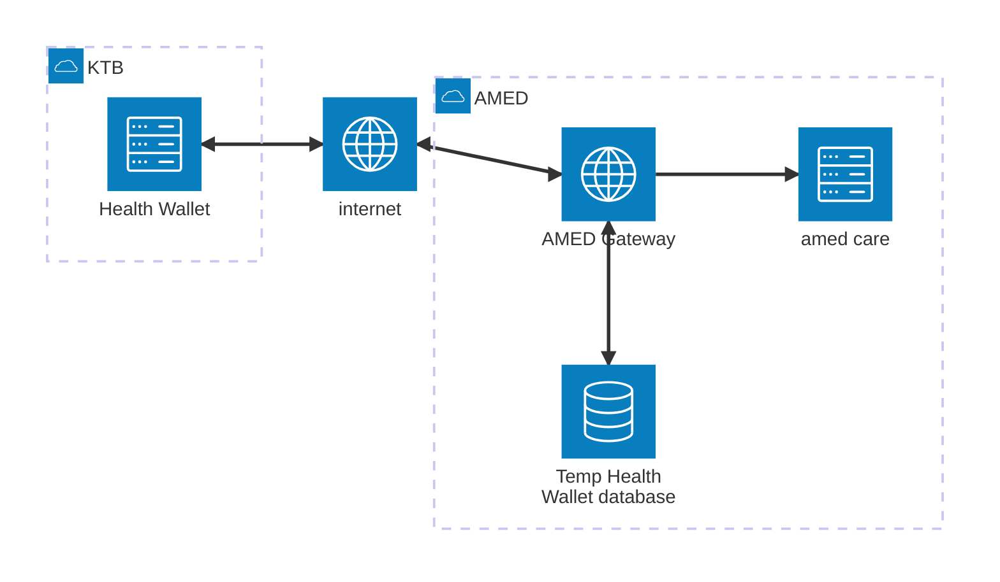
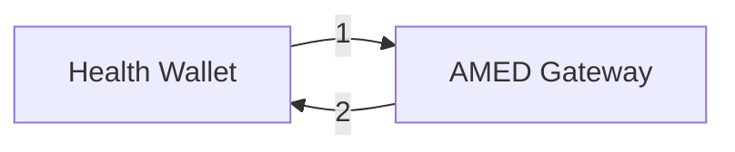
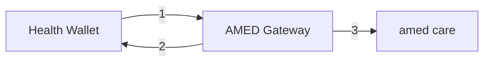
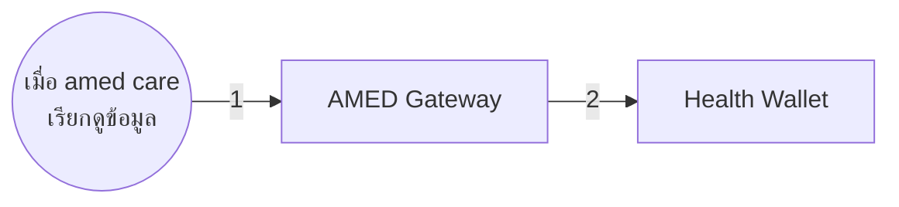
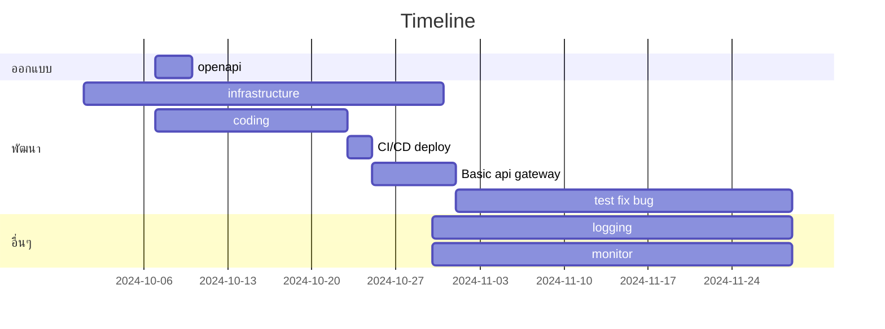

- [เกริ่น](#เกริ่น)
  - [Diagram ภาพรวม](#diagram-ภาพรวม)
  - [ออกแบบกระบวนการทำงานการไหลของข้อมูล](#ออกแบบกระบวนการทำงานการไหลของข้อมูล)
    - [1. Get Hospital List](#1-get-hospital-list)
    - [2. Create Appointment](#2-create-appointment)
    - [3. Update Appointment Status](#3-update-appointment-status)
- [Timelie](#timelie)

# เกริ่น
เป็นส่วนของไดอะแกรมการเรียกใช้งาน api ระหว่าง KTB กับ amed โดยในตอนนี้จะมีโฟลการไหลของของข้อมูลทั้งหมด 3 ข้อคือ
1. Get Hospital List เรียกดูรายชื่อหน่วยทีเข้าร่วมโครงการต่างๆ
2. Create Appointment สร้างการนัดหมาย หรือ ส่งข้อมูลรายละเอียดเข้าสู่ amed
3. Update Appointment Status ตอบกลับสถานะ ยืนยันการเข้ารับ/ยกเลิก จากข้อที่ 2 ไปยังระบบที่สร้างการนัดหมาย

## Diagram ภาพรวม

- `Health Wallet` ระบบกระเป๋าสุขภาพ
- `AMED Gateway` รับหน้าที่เป็นตัวกลางสื่อสารระหว่าง `amed care` กับ `Health Wallet` เผื่อในกรณีรูบแบบข้อมูลการสื่อสารฝั่งใดฝั่งหนึ่งเปลี่ยน หรือ บางชุดข้อมูลที่เป็นลักษณะ **static(ค่าคงที่)** จะสร้างขึ้นจากที่นี่
- `Temp Health Wallet database` ฐานข้อมูลสำหรับเก็บข้อมูลสำหรับทำงานร่วมกับ `Health Wallet` 
- `amed care` ระบบ AMED Care

## ออกแบบกระบวนการทำงานการไหลของข้อมูล
### 1. Get Hospital List
เรียกดูรายชื่อหน่วยบริการที่เข้าร่วมโครงการต่างๆ เพื่อนำเสนอหน่วยบริการให้แก่ผู้รับบริการ
- เป็นข้อมูลในลักษณะ static(ค่าคงที่) จะทำการสร้างข้อมูลที่ส่วน `AMED Gateway`
- การ update ชุดข้อมูล จะทำโดยนำเข้าข้อมูลจาก google sheet ที่เป็นลักษณะแบบสอบถาม

คลิกเพื่อเปิดดูคำอธิบายโฟล

<ol type="1">
    <li>Health Wallet ส่งคำขอข้อมูล Get Hospital List เข้ามายัง AMED Gateway</li>
    <li>AMED Gateway ทำการคืนข้อมูลรายชื่อหน่วยบริการที่เข้าร่วมโครงการ</li>
</ol> 

### 2. Create Appointment
สร้างนัดหมาย กรณีได้มีการ walk-in ไปที่หน่วยบริการ แล้วในวันนั้น จะ `ไม่อนุญาต` ให้มีการ `นัดหมายเพิ่มในวันนั้น` ไม่ว่าจะเป็นนัดหมายที่เดิมหรือที่ใหม่ ให้ระบบทำการตรวจสอบและตอบ `Error 2000 - Status doesn't match` กลับมาเพื่อป้องกันไม่ให้ผู้ป่วยนัดหมายและเข้ารับบริการซ้ำ

- จบเสร็จที่ `AMED Gateway` ไม่มีการเช็คข้อมูลจาก `amed care`

คลิกเพื่อเปิดดูคำอธิบายโฟล

<ol type="1">
    <li>Health Wallet ส่งข้อมูลสร้างนัดหมายเข้าระบบ AMED Gateway</li>
    <li>AMED Gateway ทำการสร้างนัดหมายและบันทึกรายระเอียดข้อมูล</li>
    <li>amed care มีการเรียกดูข้อมูลโดยมี input เป็น [เลขบัตร]</li>
</ol> 

### 3. Update Appointment Status
เมื่อผู้ป่วยเข้ารับบริการตามนัดหมาย ให้ส่งข้อมูลการเข้ารับบริการสำเร็จที่กลับมาที่กระเป๋าสุขภาพ `Health Wallet `

- เมื่อมีการเรียกดูข้อมูลจาก `amed care` จะส่งสถานะกลับไปยัง `Health Wallet`

คลิกเพื่อเปิดดูคำอธิบายโฟล

<ol type="1">
    <li>เมื่อ amed care มีการเรียกดูข้อมูลคนที่มีการ จองคิวไว้ระบบที่ AMED Gateway ระบบจะเริ่มกระบวนการ ส่งสถานะกลับไปยัง Health Wallet</li>
    <li>ส่งสถานะรับบริการกลับไปยัง Health Wallet</li>
</ol> 

# Timelie
