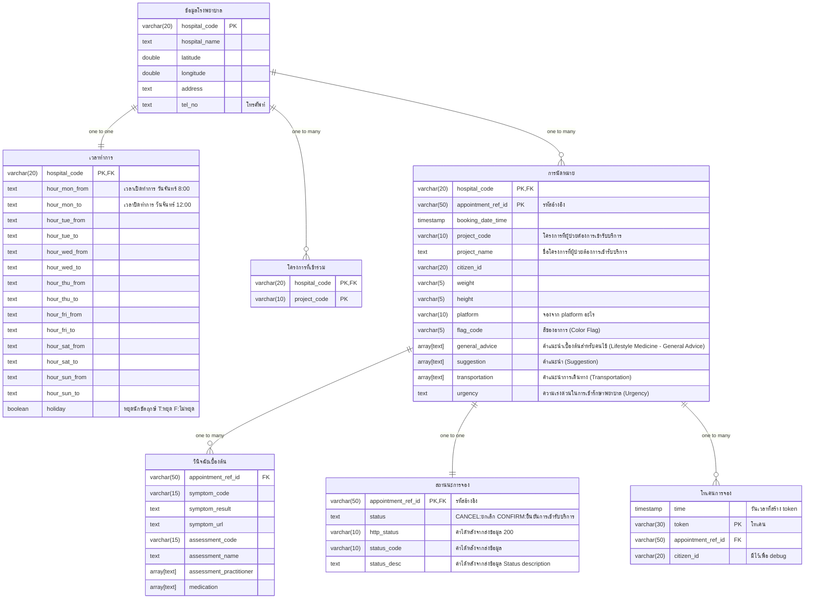
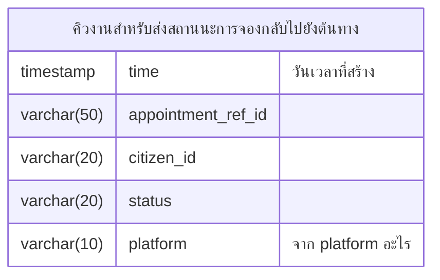
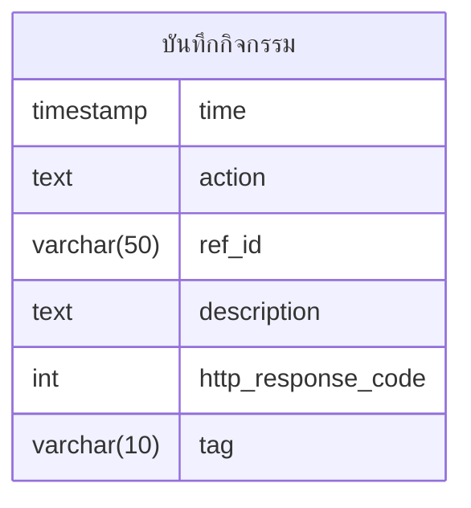

# Basic ER Diagram

---
project_code โครงการที่เข้าร่วม
- P01 : โครงการรับยา 16 อาการ
- P02 : โครงการรับยา 32 อาการ
- P03 : โครงการเจ็บป่วยเล็กน้อย 42 อาการ (TeleMedicine)
---
flag_code flag_code
- C10 : สีขาว ผู้ป่วยทั่วไป (สามารถนัดเพื่อไปรักษาวันอื่นได้ หรือพักผ่อนให้เพียงพอเพื่อดูอาการ)
- C20 : สีเขียว เจ็บป่วยเล็กน้อย 
- C30 : สีเหลือง เจ็บป่วยปานกลาง
- C40 : สีส้ม เจ็บป่วยรุนแรง
- C50 : สีแดง ผู้ป่วยวิกฤต
---
appointment_status_code (statusCode)
- 0000 = SUCCESS
- 1002 = Invalid Request format
- 2000 = Status doesn't match
- 5000 = No data found
- 9999 = General Error 

---
ใช้สำหรับบันทึกข้อมูลที่จะส่งกลับไปยังระบบที่ทำการจองมา โดยจะมีอีก กระบวนการ รับช่วงต่อตรงนี้

---
ชุดข้อมูลสำหรับบันทึกกิจกรรม
