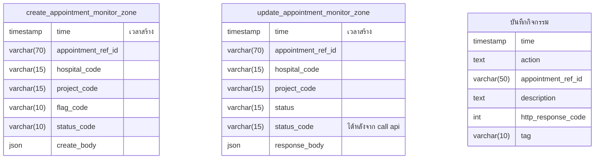

# สำหรับการ Monitor

```mermaid
erDiagram
    create_appointment_monitor_zone{
        timestamp time "เวลาสร้าง"
        varchar(70) appointment_ref_id
        varchar(15) hospital_code
        varchar(15) project_code
        varchar(10) flag_code
        varchar(10) status_code
        json create_body
    }

    update_appointment_monitor_zone{
        timestamp time "เวลาสร้าง"
        varchar(70) appointment_ref_id
        varchar(15) hospital_code
        varchar(15) project_code
        varchar(15) status
        varchar(15) status_code "ได้หลังจาก call api"
        json response_body
    }

    activity_log_zone["บันทึกกิจกรรม"]{
        timestamp time
        text action
        varchar(50) appointment_ref_id
        text description
        int http_response_code
        varchar(10) tag
    }

```