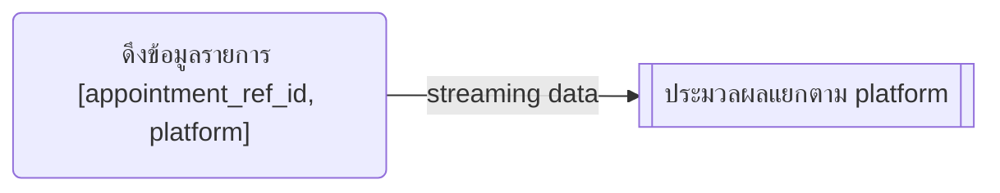
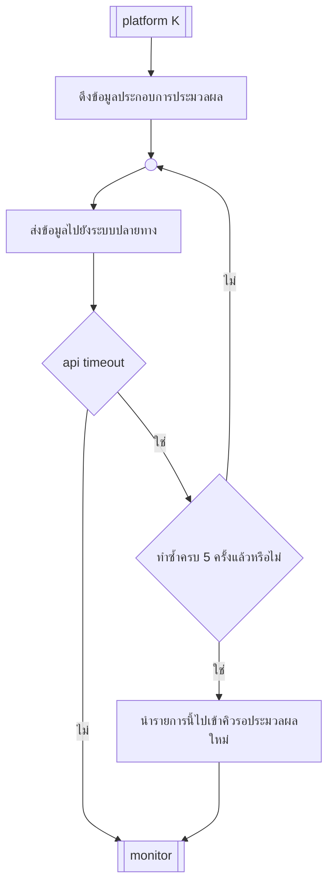

# Update Appointment Status
เมื่อผู้ป่วยเข้ารับบริการตามนัดหมาย ให้ partner ทำการส่งข้อมูลการเข้ารับบริการสำเร็จที่กลับมาที่ระบบที่สร้างนัดหมาย  
โดยจะมีรายการประมวลผลเข้ามาต่อเมื่อ มีการเรียกดูข้อมูลผ่าน [Get Information](getInformation.md)

## โครงสร้างข้อมูล
ใช้แนวคิดจาก Message Queue(MQ) ฉะนันโฟลที่ออกแบบสามารถปรับเปลี่ยนรองรับได้ทั้ง แบบ database และ MQ

### Consumer feed
ตัวที่รับข้อมูลมาจาก Queue

### platform K

