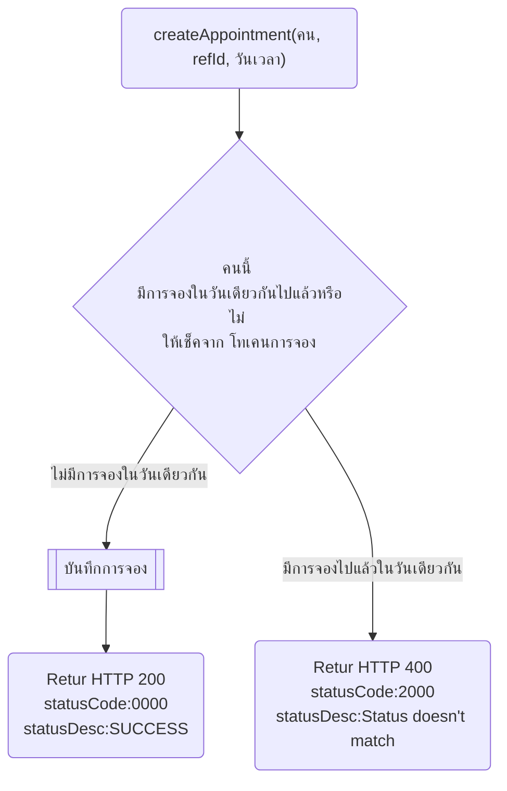
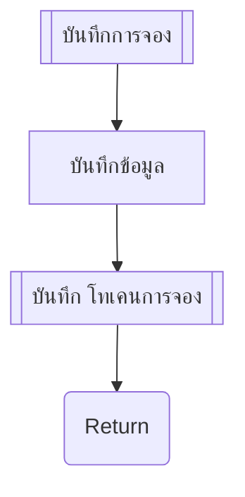

# Create Appointment
สำหรับส่งสร้างนัดหมายไปยัง partner โดยจะทำการส่งวันที่นัดหมาย สิทธิ และผลการประเมินอาการเบื้องต้นที่ไดีรับจาก AI ประเมินอาการ เพื่อประกอบการเข้ารับบริการ
โดยมีเงื่อนไขการส่งสร้างนัดหมาย ดังนี้
1. กรณีผู้ป่วยมีนัดหมายแล้วในวันนั้น ระบบจะไม่อนุญาติให้ทำการนัดหมายซ้ำ แต่นำเสนอให้กลับไปหน่วยบริการเดิมที่มีนัดหมาย
2. กรณีผู้ป่วย ได้มีการ walk-in แล้วในวัันนั้น เมื่อมีการส่งนัดหมาย partner ทำการตรวจสอบและตอบ Error 2000 - Status doesn't match กลับมาเพื่อป้องกันไม่ให้ผู้ป่วยนัดหมายและเข้ารับบริการซ้ำ

---
โฟล บันทึกการจอง

---
## รูปแบบ โทเคนการจอง
ณ ตอนนี้ให้ 1 คน 1 ครั้งต่อวันจะใช้รูปแบบตามนี้  
`token` = `citizenId` ต่อด้วย `ปี เดือน วัน ที่จอง`