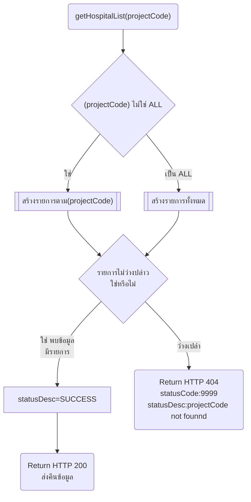

# Get Hospital List
เรียกดูรายชื่อหน่วยบริการที่เข้าร่วมโครงการต่างๆ เพื่อนำเสนอหน่วยบริการให้แก่ผู้รับบริการ

```mermaid
flowchart TD
    s("getHospitalList(projectCode)")
    v{"(projectCode) ไม่ใช่ ALL"}
    p[["สร้างรายการตาม(projectCode)"]]
    check_empty{"รายการไม่ว่างปล่าว </br>ใช่หรือไม่"}
    success["statusDesc=SUCCESS"]
    r("Return HTTP 200 <br>ส่งคืนข้อมูล")

    s-->v-->|ใช่|p-->check_empty-->|"ใช่ พบข้อมูล </br>มีรายการ"|success-->r

    all[["สร้างรายการทั้งหมด"]]
    
    %% projectCode เป็น ALL
    v-->|เป็น ALL|all
    all-->check_empty

    %% เมื่อไม่มีข้อมูลรายการ
    else("Return HTTP 404<br>statusCode:9999<br>statusDesc:projectCode not founnd")
    check_empty-->|"ว่างเปล่า"|else

```