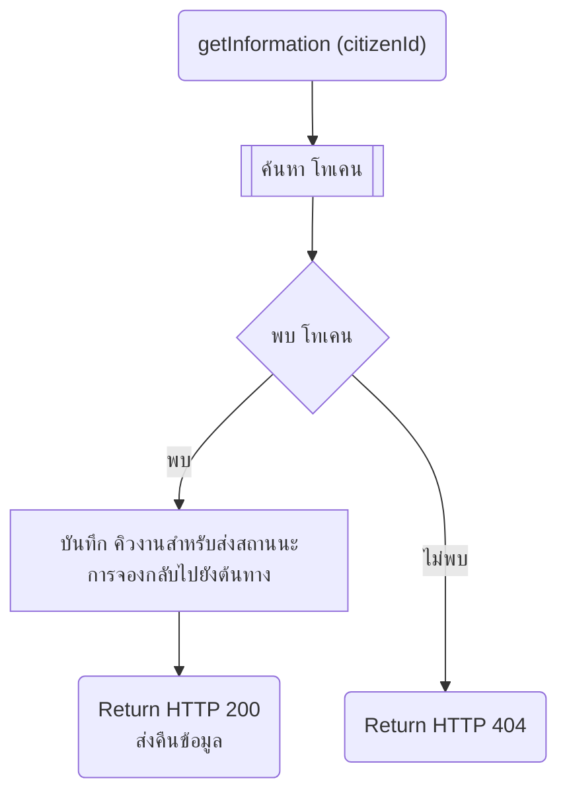

# Get Information
สำหรับเรียกดูข้อมูลการจอง ข้อมูลที่ส่งกลับจะเป็นข้อมูลแบบเดียวกับที่ส่งจองเข้ามา โดยจะคืนค่าข้อมูลการจองเฉพาะวันเดียวกันกับที่เรียกมาเท่านั้น

```mermaid
flowchart TD
    s("getInformation (citizenId)")
    token[["ค้นหา โทเคน"]]
    found_check{"พบ โทเคน"}
    queue_appointment_confirm_status["บันทึก คิวงานสำหรับส่งสถานนะการจองกลับไปยังต้นทาง"]
    r("Return HTTP 200 <BR>ส่งคืนข้อมูล")

    s-->token-->found_check-->|พบ|queue_appointment_confirm_status-->r

    token_not_found("Return HTTP 404")
    found_check--->|"ไม่พบ"|token_not_found
```
